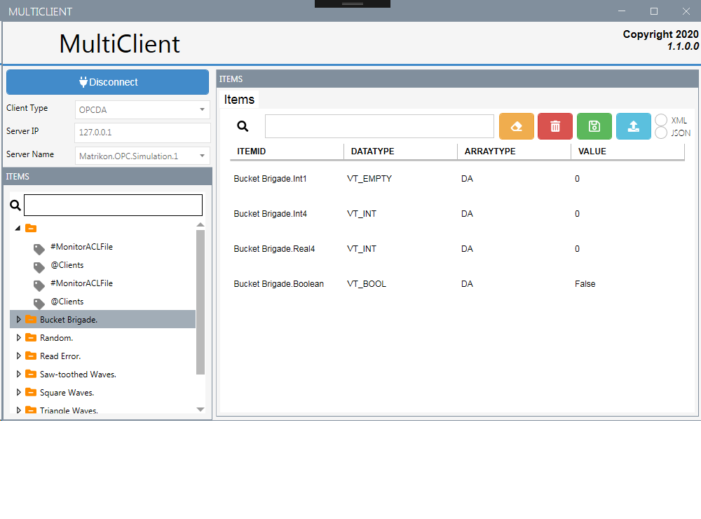

# MultiClient

Client Application in .NET using WPF for reading OPC items with diferents protocols

  

## Features
- Support for Modbus,OPC DA,OPC UA
- Subscription to items changes.
- Save Items in JSON / XML

### Libraries used
- EasyModbus (easymodbustcp.net) 
  https://github.com/rossmann-engineering/EasyModbusTCP.NET
- OPCDA (TitaniumAS.Opc.Client) 
  https://github.com/titanium-as/TitaniumAS.Opc.Client
  -OPCUA
  https://github.com/OPCFoundation
